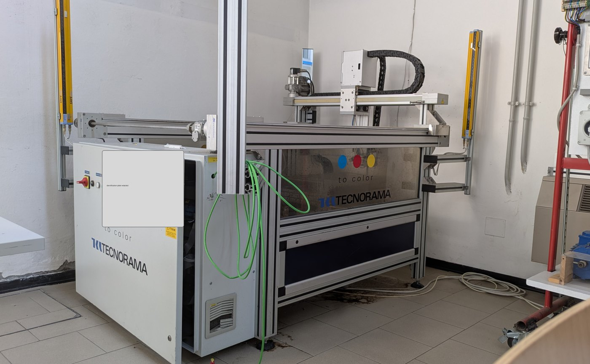
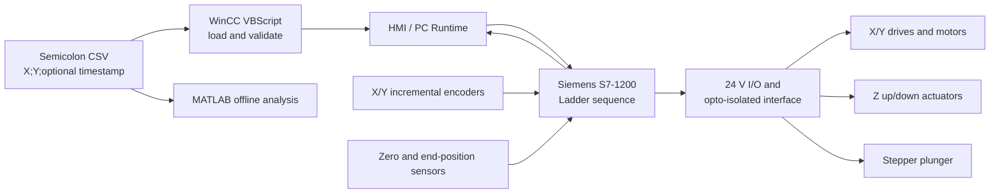

# Three-Axis Cartesian Dosing Machine — PLC, HMI, CSV and Motion Analysis

> **Sintesi in italiano.** Questo repository documenta il recupero e l'analisi tecnica di una macchina dosatrice cartesiana a tre assi controllata da PLC Siemens S7-1200 e HMI WinCC/TIA Portal V15. Le fonti originali sono state confrontate senza modificarle; i progetti TIA completi, gli schemi del costruttore e le fotografie non anonimizzate non sono pubblicati. Gli script MATLAB aggiunti qui analizzano traiettorie e modelli cinematici, ma non sostituiscono prove sperimentali sulla macchina.

## Purpose and evidence status

This is a technical case study built from an archived automation project and a later photographic inspection. Its purpose is to make curriculum claims auditable: each claimed skill points to a document, script, test or traceable source class.

The repository uses six evidence labels:

| Label | Meaning |
|---|---|
| **Observed** | Visible in the supplied photographs. |
| **Documented** | Stated in an original report, wiring table or project artifact. |
| **Recovered** | Reconstructed from searchable TIA/WinCC project data; exact runtime behavior still requires the original engineering environment. |
| **Simulated** | Produced by the MATLAB models in this repository, using explicit assumptions. |
| **Proposed** | Engineering improvement not shown as installed. |
| **Unverified** | Requires TIA Portal, electrical measurements or a physical-machine test. |

No measured accuracy, encoder resolution, sampling frequency or production cycle time was available in the archive. None is claimed here.

## System at a glance

The machine is a Cartesian positioning system with:

- X and Y travel driven through two-speed commands and direction signals to motor drives;
- a vertical Z head with up/down commands and end-position inputs;
- a separate stepper-driven dosing plunger;
- incremental feedback channels for X and Y;
- a Siemens S7-1200 PLC, HMI/PC runtime, VBScript and semicolon-delimited CSV point lists;
- sequence logic that moves to target coordinates, detects an arrival window and coordinates the Z/dosing actions.



The public image is downscaled, stripped of EXIF metadata and masked at the machine identification plate. It records physical presence only; it is not evidence of a successful functional test. Publication rights and processing notes are documented in [docs/assets/README.md](docs/assets/README.md).

## Architecture



See [system architecture](docs/system-architecture.md), [hardware architecture](docs/hardware-architecture.md) and [CSV/HMI/PLC data flow](docs/csv-import.md).

## Hardware and software evidence

| Area | Evidence-backed finding | Status |
|---|---|---|
| PLC | Siemens S7-1200 family; the 2026 cabinet photograph shows a CPU 1214C DC/DC/DC. A design workbook instead specifies S7-1215C. | Observed + documented conflict |
| Engineering software | Project descriptors and HMI download metadata identify TIA Portal / WinCC V15. | Documented |
| HMI | KTP700 Basic PN and WinCC Runtime Advanced targets are present in compiled project artifacts. | Recovered |
| X/Y actuation | Two Altivar 28 drives rated 0.37 kW are visible; the I/O list defines two speed selections and one direction command per axis. | Observed + documented |
| Feedback | A/B incremental channels are assigned for both X and Y. Exact encoder model and pulses per revolution are unreadable. | Documented; resolution unverified |
| Interface | Project sheets describe opto-isolated 5 V/24 V interface boards and an SM1223 expansion module. | Documented; installed configuration requires TIA/hardware check |
| CSV | Original scripts use `FileSystemObject`, semicolon splitting and HMI tag transfer. Source samples contain both two-field and three-field rows. | Recovered + documented |
| PLC logic | Searchable symbols/comments support homing, high-speed counters, in-range arrival, two-speed motion and sequence indexing. Exact Ladder networks are not exported. | Recovered; compile unverified |

A detailed source/conflict register is in [docs/source-register.md](docs/source-register.md).

## Operating and data flow

1. The operator selects manual, semi-automatic, automatic or stepper-plunger control from the HMI/PC runtime.
2. In point-list operation, VBScript reads a semicolon-delimited file and transfers X/Y vectors plus the point count to HMI/PLC tags.
3. The PLC validates permissive conditions, establishes a reference through homing and loads the current target.
4. X and Y direction and speed commands are selected. Archived descriptions state that low speed is used near departure/arrival and higher speed between those regions.
5. Encoder counters are compared with target coordinates. The axis stops inside an arrival band rather than at an ideal mathematical point; the archive explicitly associates this with inertia.
6. The sequence index advances only after the required arrival/action conditions are met.
7. The Z head and dosing plunger are coordinated through end-position and permissive signals.

This flow is a reconstruction. The actual block calls, scan ordering, timeout handling and all safety interlocks must be checked in TIA Portal before reuse.

## MATLAB analysis

The `matlab/` directory provides auditable offline analyses for:

- CSV parsing and point validation;
- path visualization and total path length;
- triangular/trapezoidal motion-time estimates;
- separate position, velocity and acceleration profiles;
- nearest-neighbour point ordering;
- sampling and quantisation sensitivity;
- a simulated position-observation error caused by sample-and-hold and quantisation.

All source coordinates remain in **encoder-count units** because the archive provides no verified count-to-millimetre calibration. Default kinematic values are marked as illustrative assumptions and are not machine specifications.

From the repository root, run the analyses:

```matlab
cd matlab
addpath('functions')
run('scripts/run_all_analyses.m')
```

Then return to the repository root and run the public contract tests:

```matlab
cd ..
run('tests/run_all_tests.m')
```

See [matlab/README.md](matlab/README.md) for assumptions, outputs and compatibility notes.

## Main technical issues identified

- **Version ambiguity:** twelve extracted `.ap15` projects and six `.zap15` archives exist; no single snapshot can be proven to be the canonical deployed version.
- **Hardware configuration conflict:** design records specify a CPU 1215C, while the photographed cabinet shows a CPU 1214C DC/DC/DC.
- **I/O conflict:** one workbook assigns `I1.5` both to a Z dosage-position signal and to a stepper high-speed-counter clock; the compact I/O PDF assigns it only to the former.
- **CSV robustness:** recovered scripts contain hard-coded Windows paths, permissive error handling and no demonstrated bounds guard for a 1001-element array.
- **Motion accuracy:** arrival-band and inertia behavior are described, but no calibration, repeatability study, traceable test log or measured settling time is present.
- **Safety evidence:** optical devices and electrical protection are visible, but no safety validation, risk assessment or verified safety-PLC function is included.

## Repository map

| Path | Contents |
|---|---|
| `docs/` | Architecture, PLC/HMI/CSV reconstruction, history, limitations and verification matrix. |
| `plc/` | Block map, I/O map, sequence description and non-deployable pseudocode. |
| `hmi/` | Screen map and clean-room VBScript examples with configurable paths and validation. |
| `matlab/` | Analysis scripts, reusable functions, sample datasets and generated preview figures. |
| `examples/csv/` | Valid and deliberately invalid CSV fixtures. |
| `tests/` | MATLAB contract tests and manual verification procedures. |
| `private_archive_manifest/` | Categories of excluded original files and publication rationale. |
| `metadata/` | Sanitised inventory, source comparison and build-validation record. |

## Review paths

**Five-minute review:** this README, [technical skills evidence](TECHNICAL_SKILLS_EVIDENCE.md), and [personal contribution](PERSONAL_CONTRIBUTION.md).

**Fifteen-minute review:** add [PLC program](docs/plc-program.md), [HMI/VBScript](docs/hmi-and-vbscript.md), [motion analysis](docs/motion-analysis.md), and [verification matrix](docs/verification-matrix.md).

**Engineering review:** inspect the MATLAB functions/tests, the I/O conflict log, the source register, the [build-validation record](metadata/build-validation.md), and the publication exclusions. Then open the private TIA project in a licensed V15 environment and execute the pending checks in [docs/testing.md](docs/testing.md).

## Personal contribution

The original machine, manufacturer documentation and part of the student retrofit predate this repository. The archive contains multiple contributor attributions, and the identity of the repository owner cannot be inferred from the files alone. Therefore [PERSONAL_CONTRIBUTION.md](PERSONAL_CONTRIBUTION.md) separates:

- pre-existing machine and electrical documentation;
- collaborative PLC/HMI/interface work already in the archive;
- later recovery and source comparison;
- newly written MATLAB analyses and public documentation;
- proposals that have not been implemented.

The CV wording must be retained only for activities the student can personally confirm.

## Public/private boundary

The public repository intentionally excludes:

- complete `.ap15` and `.zap15` TIA projects;
- compiled WinCC runtime packages and project databases;
- the manufacturer electrical drawing set;
- original spreadsheets, shared-drive screenshots and unredacted photographs;
- local file paths, IP addresses, serial numbers and personal names;
- temporary files, backups and generated runtime recipes.

See [private_archive_manifest/excluded-files.md](private_archive_manifest/excluded-files.md) and [docs/security-review.md](docs/security-review.md).

## License and disclaimer

New documentation, MATLAB code, tests, diagrams and clean-room script examples in this repository are released under the [MIT License](LICENSE). Original Siemens project data, manufacturer documents, source records and raw photographs are **not** relicensed and are not included. The two redacted evidence images have a separate rights notice in [docs/assets/README.md](docs/assets/README.md).

This repository is for study and documentation. It is not a validated control program, safety function or commissioning procedure. Do not connect, download or energise machinery from these files without an authorised engineering review, machine-specific risk assessment and tests by qualified personnel.
