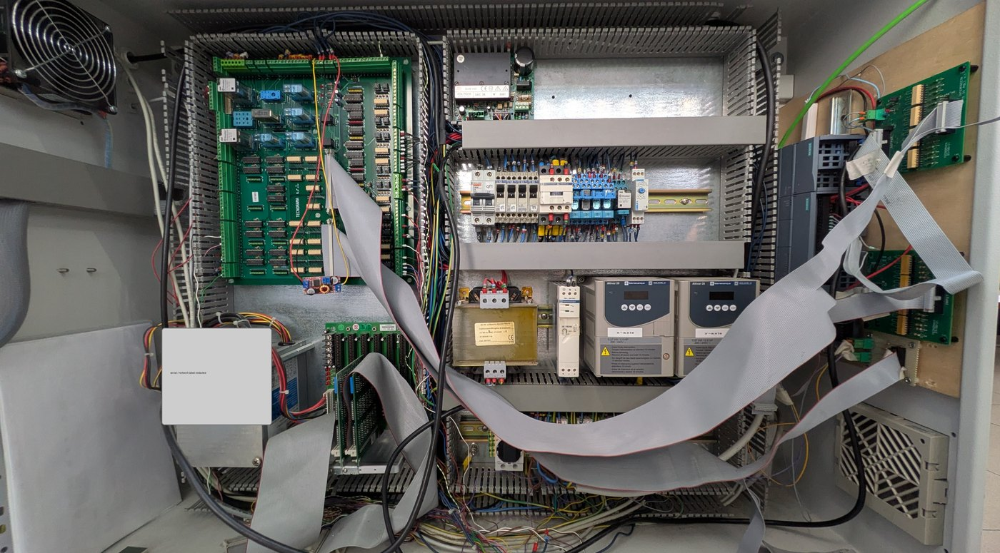

# Hardware Architecture

## Visible machine structure

The photographic source shows a portal/cartesian mechanism with long X/Y travel members, a vertical head and a separate cabinet. The source report calls the moving vertical head a pipette and describes a stepper motor driving the plunger.

The image is publication-sanitised and documents visible components only.

## Confirmed or strongly supported components

| Component | Finding | Basis | Limit |
|---|---|---|---|
| PLC | SIMATIC S7-1200 CPU 1214C DC/DC/DC visible | Photograph | Exact firmware and downloaded hardware configuration unknown |
| Design CPU | S7-1215C requested in workbook | Design record | Conflicts with photograph |
| HMI | KTP700 Basic PN target and PC WinCC Runtime Advanced target | TIA HMI metadata | Physical panel communication not tested |
| X/Y drives | Two Altivar 28 units, 0.37 kW / 0.5 HP visible | Photograph | Parameter sets and motor data unavailable |
| PLC supply | Siemens PM 1207 24 V DC module visible | Photograph | Load/current test unavailable |
| I/O expansion | SM1223 expansion specified in project workbook | Document | Part number/installed wiring not independently confirmed from photo |
| Interface | Four opto-isolated interface boards described; boards/flat cables visible | Workbook + photograph | Channel-by-channel continuity unavailable |
| Encoders | X/Y A/B input channels documented; an incremental encoder is visible | I/O map + photograph | Exact model, PPR and mechanical ratio unreadable |
| Safety devices | Paired yellow optical devices visible | Photograph | Function, wiring, PL/SIL/category and validation unknown |

## Axes and functions

### X axis

Two discrete speed commands and one direction/inversion command are documented. Encoder A/B channels and a zero-position input provide feedback/reference.

### Y axis

The same command pattern as X is documented, with independent encoder A/B channels and zero sensor.

### Z mechanism

The compact I/O map provides separate raising and lowering outputs plus upper/lower position inputs. Another input is labelled dosage position. Exact actuator technology is not stated.

### Dosing plunger

A separate stepper command group includes step, enable and direction. The report describes manual enable/direction/three-speed control of the plunger. Pulse generation and frequency limits require TIA verification.

## Electrical interface

The workbook describes adaptation between legacy 5 V machine electronics and 24 V PLC I/O through optocouplers, resistor networks and 20-pole flat cables. This is design evidence, not a certified schematic. The manufacturer drawing package is excluded from publication.

## Hardware questions to close

- Which CPU/module configuration is actually configured in the deployable TIA project?
- Is the expansion I/O installed and addressed as documented?
- What are encoder PPR, quadrature multiplier, gear ratios and travel per revolution?
- What are drive input truth tables and parameter values for speed selection?
- Which circuits implement emergency stop and optical protection, and are they safety-rated?
