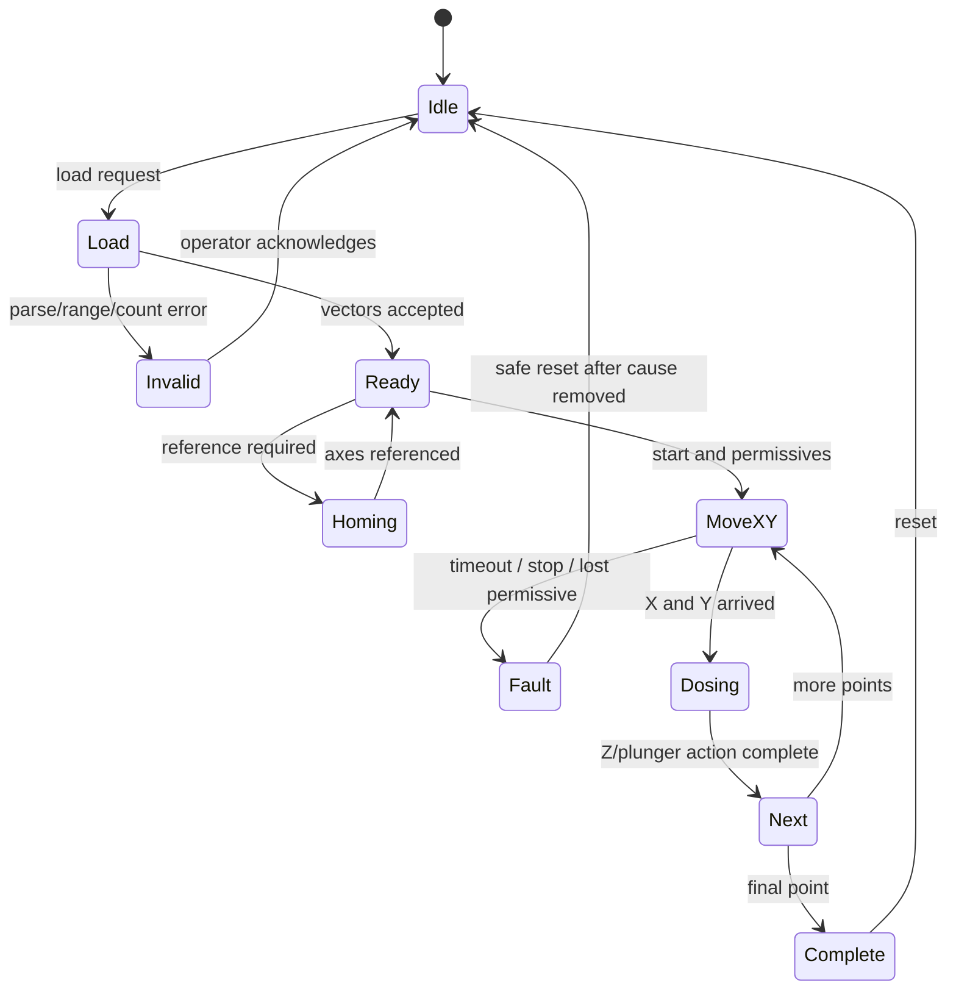

# Operating Sequence

## Modes documented in the 2022/2023 report

### 1. Manual

Operator directly commands axis direction/speed. Homing is described as the only automatic action in this mode.

### 2. Semi-automatic

Operator enters X and Y coordinates. The source describes a range check against axis travel expressed in encoder pulses. Valid targets cause motion; invalid targets generate an HMI error. The machine is described as stopping inside a neighbourhood of the target because of inertia.

### 3. Automatic

The report describes four operator numbers: three source/color positions and one destination/mixing position. Software calculates coordinates, moves to each source, lowers the Z pipette, performs collection/deposition and repeats. The exact calculation table and dosing quantities are absent.

### 4. Stepper plunger

Manual enable, direction and three speed choices are described for the dosing plunger.

## Point-list sequence reconstructed from CSV variants

Only the high-level transitions are supported. Timeout and fault branches are required engineering controls; their original implementation has not been verified.

## State data to verify in TIA

- current index and maximum point count;
- X/Y target arrays and data types;
- arrived flags and tolerance values;
- Z action request/acknowledge signals;
- dwell/process times;
- abort behavior and resume policy;
- completion and HMI status tags.
