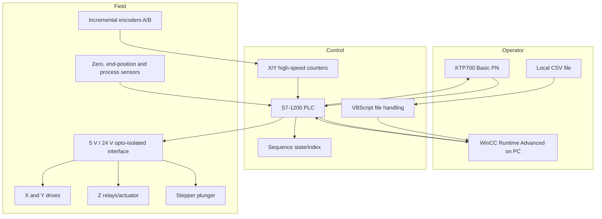

# System Architecture

## Functional boundary

The reconstructed control boundary starts at HMI commands or a CSV file and ends at PLC output commands. It does not include verified drive parameter sets, motor transfer functions or safety certification.

## Control responsibilities

- **HMI:** mode selection, manual commands, coordinate entry, status and file-load request.
- **VBScript:** non-real-time local file access and transfer into HMI tags.
- **PLC:** deterministic permissives, counters, target comparison, output arbitration and sequence transitions.
- **Drives/interface:** electrical adaptation and motor command execution.
- **MATLAB:** offline evaluation only; no direct connection to the PLC is supplied.

## Trust boundaries

CSV and HMI inputs are untrusted until validated. A valid file is not sufficient to authorise motion: PLC range, homing, sensor, mode and safety conditions must remain authoritative.
